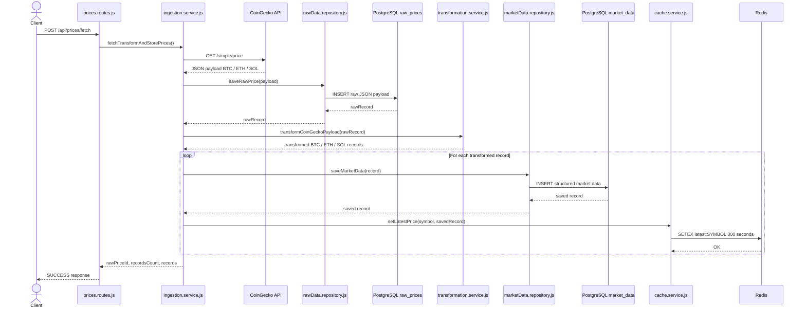

# MarketPulse — Architecture

This document explains the current architecture of the MarketPulse project.

The goal is to understand:

- which component calls which component;
- how the ingestion pipeline works;
- where data is stored;
- how Redis is used;
- how the project is structured internally.

---

## 1. Architecture overview

MarketPulse is a backend/data pipeline built with Node.js and Express.

It retrieves crypto prices from CoinGecko, stores the raw payload in PostgreSQL, transforms the data into structured market records, updates Redis with the latest prices, and exposes the results through REST APIs.

```mermaid
flowchart TB
    CLIENT[Client / curl / future frontend]
    COINGECKO[CoinGecko API]

    subgraph API[MarketPulse Backend - Node.js / Express]
        SERVER[server.js - Starts app, DB, Redis, cron]
        APP[app.js - Registers routes]

        subgraph ROUTES[Routes Layer]
            HEALTH_ROUTE[health.routes.js - GET /health]
            PRICES_ROUTE[prices.routes.js - /api/prices]
            INGESTION_ROUTE[ingestion.routes.js - /api/ingestions]
        end

        subgraph SERVICES[Services Layer]
            HEALTH_SERVICE[health.service.js - Dependency health checks]
            MARKET_SERVICE[marketData.service.js - Price read logic and cache-aside flow]
            INGESTION_MONITORING[ingestionMonitoring.service.js - Ingestion monitoring queries]
            INGESTION[ingestion.service.js - Fetch and orchestrate pipeline]
            TRANSFORMATION[transformation.service.js - Normalize CoinGecko payload]
            DATA_QUALITY[dataQuality.service.js - Validate payload and transformed records]
            CACHE[cache.service.js - Redis cache operations]
        end

        subgraph JOBS[Scheduled Jobs]
            CRON[priceIngestion.job.js - Runs every 60 seconds]
        end

        LOGGER[logger.js - Structured Winston logs]
    end

    subgraph REPOSITORIES[Repository Layer]
        RAW_REPO[rawData.repository.js]
        MARKET_REPO[marketData.repository.js]
        INGESTION_REPO[ingestionRun.repository.js]
        DATA_QUALITY_REPO[dataQuality.repository.js]
    end

    subgraph STORAGE[Storage Layer]
        POSTGRES_RAW[(PostgreSQL raw_prices)]
        POSTGRES_MARKET[(PostgreSQL market_data)]
        POSTGRES_INGESTION[(PostgreSQL ingestion_runs)]
        POSTGRES_QUALITY[(PostgreSQL data_quality_checks)]
        REDIS[(Redis latest:BTC / latest:ETH / latest:SOL)]
    end

    CLIENT -->|GET /health| HEALTH_ROUTE
    CLIENT -->|POST /api/prices/fetch| PRICES_ROUTE
    CLIENT -->|GET /api/prices/latest| PRICES_ROUTE
    CLIENT -->|GET /api/prices/latest/:symbol| PRICES_ROUTE
    CLIENT -->|GET /api/prices/history/:symbol| PRICES_ROUTE
    CLIENT -->|GET /api/ingestions/*| INGESTION_ROUTE

    SERVER --> APP
    SERVER --> CRON
    APP --> HEALTH_ROUTE
    APP --> PRICES_ROUTE
    APP --> INGESTION_ROUTE

    HEALTH_ROUTE --> HEALTH_SERVICE
    PRICES_ROUTE --> MARKET_SERVICE
    PRICES_ROUTE --> INGESTION
    INGESTION_ROUTE --> INGESTION_MONITORING
    CRON --> INGESTION

    HEALTH_SERVICE --> POSTGRES_RAW
    HEALTH_SERVICE --> REDIS

    MARKET_SERVICE --> CACHE
    MARKET_SERVICE --> MARKET_REPO
    CACHE --> REDIS
    MARKET_REPO --> POSTGRES_MARKET

    INGESTION_MONITORING --> INGESTION_REPO
    INGESTION_MONITORING --> DATA_QUALITY_REPO
    INGESTION_REPO --> POSTGRES_INGESTION
    DATA_QUALITY_REPO --> POSTGRES_QUALITY

    INGESTION -->|HTTP request| COINGECKO
    COINGECKO -->|JSON payload| INGESTION

    INGESTION --> INGESTION_REPO
    INGESTION --> RAW_REPO
    INGESTION --> TRANSFORMATION
    INGESTION --> DATA_QUALITY
    INGESTION --> MARKET_REPO
    INGESTION --> CACHE

    RAW_REPO --> POSTGRES_RAW
    TRANSFORMATION --> MARKET_REPO
    DATA_QUALITY --> DATA_QUALITY_REPO
    MARKET_REPO --> POSTGRES_MARKET

    SERVER -. logs .-> LOGGER
    HEALTH_ROUTE -. logs .-> LOGGER
    PRICES_ROUTE -. logs .-> LOGGER
    INGESTION_ROUTE -. logs .-> LOGGER
    HEALTH_SERVICE -. logs .-> LOGGER
    MARKET_SERVICE -. logs .-> LOGGER
    INGESTION_MONITORING -. logs .-> LOGGER
    INGESTION -. logs .-> LOGGER
    TRANSFORMATION -. logs .-> LOGGER
    DATA_QUALITY -. logs .-> LOGGER
    CACHE -. logs .-> LOGGER
    CRON -. logs .-> LOGGER
```



---

## 2. Main layers

### Client layer

The client can be:

- `curl`;
- Postman;
- a future frontend;
- any HTTP consumer.

The client calls the REST API exposed by Express.

---

### Routes layer

The routes layer receives HTTP requests.

Main route files:

```text
src/routes/health.routes.js
src/routes/prices.routes.js
src/routes/ingestion.routes.js
```

The routes do not contain business logic or direct SQL/data-access logic.  
They delegate work to services.

---

### Services layer

The services layer contains the main application logic.

Main services:

```text
src/services/health.service.js
src/services/marketData.service.js
src/services/ingestionMonitoring.service.js
src/services/ingestion.service.js
src/services/transformation.service.js
src/services/dataQuality.service.js
src/services/cache.service.js
```

Responsibilities:

- check PostgreSQL and Redis health;
- retrieve latest and historical market data;
- coordinate Redis cache-aside behavior for latest prices;
- expose ingestion monitoring data;
- call CoinGecko;
- store raw data;
- transform the payload;
- run data quality checks;
- save structured market data;
- update Redis cache.

---

### Repository layer

The repository layer isolates SQL queries.

Main repositories:

```text
src/repositories/rawData.repository.js
src/repositories/marketData.repository.js
src/repositories/ingestionRun.repository.js
src/repositories/dataQuality.repository.js
```

Responsibilities:

- insert raw payloads into `raw_prices`;
- insert structured records into `market_data`;
- retrieve latest prices;
- retrieve price history;
- track ingestion runs in `ingestion_runs`;
- store and retrieve data quality checks.

---

### Storage layer

The storage layer contains:

```text
PostgreSQL
Redis
```

PostgreSQL stores durable data.  
Redis stores temporary cached latest prices.

---

## 3. Main fetch flow

This diagram explains what happens when the client manually triggers ingestion with:

```bash
curl -X POST http://localhost:3000/api/prices/fetch
```



---

## 4. What happens during ingestion?

When ingestion starts, the application follows this sequence:

```text
1. The client calls POST /api/prices/fetch
2. prices.routes.js calls ingestion.service.js
3. ingestion.service.js calls CoinGecko
4. CoinGecko returns a JSON payload
5. The raw JSON payload is saved in PostgreSQL table raw_prices
6. The payload is transformed into structured market records
7. BTC, ETH and SOL records are saved in PostgreSQL table market_data
8. Redis is updated with latest:BTC, latest:ETH and latest:SOL
9. The API returns a success response
```

Each ingestion cycle creates:

```text
1 row in raw_prices
3 rows in market_data
```

One row is created for each tracked symbol:

```text
BTC
ETH
SOL
```

---

## 5. Redis cache behavior

The latest symbol endpoint uses Redis first.

Example:

```bash
curl http://localhost:3000/api/prices/latest/BTC
```

Flow:

```text
1. prices.routes.js receives GET /api/prices/latest/BTC
2. The route calls marketData.service.js
3. marketData.service.js checks Redis key latest:BTC through cache.service.js
4. If Redis contains the value, the API returns source: "cache"
5. If Redis does not contain the value, marketData.service.js reads PostgreSQL through marketData.repository.js
6. The PostgreSQL result is stored again in Redis
7. The API returns source: "database"
```

Redis keys:

```text
latest:BTC
latest:ETH
latest:SOL
```

TTL:

```text
300 seconds
```

---

## 6. Scheduled ingestion

The project also includes automatic ingestion.

The scheduled job is defined in:

```text
src/jobs/priceIngestion.job.js
```

It runs every 60 seconds using `node-cron`.

Flow:

```text
node-cron
→ priceIngestion.job.js
→ ingestion.service.js
→ CoinGecko
→ raw_prices
→ transformation.service.js
→ market_data
→ Redis
```

The manual route and the scheduled job reuse the same ingestion logic.

This avoids duplicating pipeline behavior.

---

## 7. Health check flow

The health endpoint is:

```bash
curl http://localhost:3000/health
```

It checks:

```text
API status
PostgreSQL connection through health.service.js
Redis connection through health.service.js
```

Expected response:

```json
{
  "status": "UP",
  "service": "marketpulse-api",
  "dependencies": {
    "database": "UP",
    "redis": "UP"
  }
}
```

---

## 8. Logging

The application uses Winston for structured JSON logs.

Logs are produced by several components:

```text
server.js
health.routes.js
prices.routes.js
ingestion.routes.js
health.service.js
marketData.service.js
ingestionMonitoring.service.js
ingestion.service.js
transformation.service.js
dataQuality.service.js
cache.service.js
priceIngestion.job.js
```

Examples of events:

```text
SERVER_STARTED
DATABASE_CONNECTED
REDIS_CONNECTED
INGESTION_START
PRICE_FETCHED
RAW_PRICE_STORED
PRICE_TRANSFORMED
MARKET_DATA_STORED
CACHE_SET
CACHE_HIT
CACHE_MISS
PRICE_INGESTION_JOB_TRIGGERED
PRICE_INGESTION_JOB_COMPLETED
```

These logs could later be shipped to:

```text
CloudWatch
ELK
Grafana / Loki
```

---

## 9. Current architecture limitation

The current project is a working backend/data pipeline, but it is not yet truly event-driven.

Today, the ingestion service still orchestrates the pipeline directly.

Current style:

```text
Ingestion service
→ calls transformation directly
→ saves market data directly
→ updates Redis directly
```

Future event-driven target:

```text
PriceFetchedEvent
→ Transformation handler

PriceTransformedEvent
→ Cache handler
```

This future version could first be implemented locally with Node.js `EventEmitter`, then later mapped to Kafka, RabbitMQ, or AWS EventBridge.

---

## 10. Summary

MarketPulse currently demonstrates:

```text
REST API
layered route/service/repository architecture
external API ingestion
ETL-style transformation
PostgreSQL raw and structured storage
Redis cache
scheduled jobs
structured logs
unit tests
Docker Compose local infrastructure
```

The next architecture improvement is:

```text
introduce local event-driven flow with Node.js EventEmitter
```
